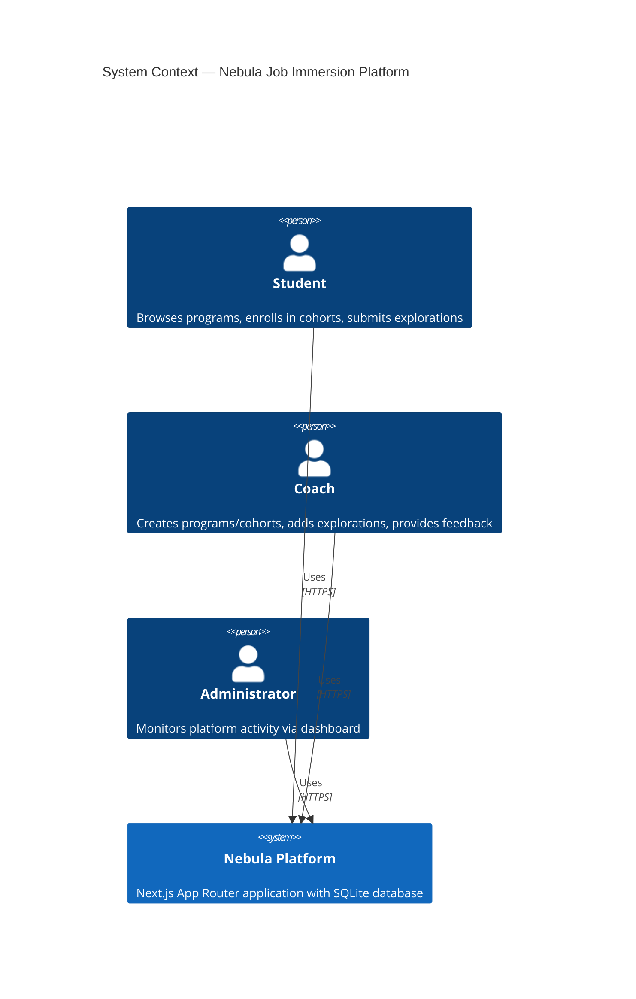
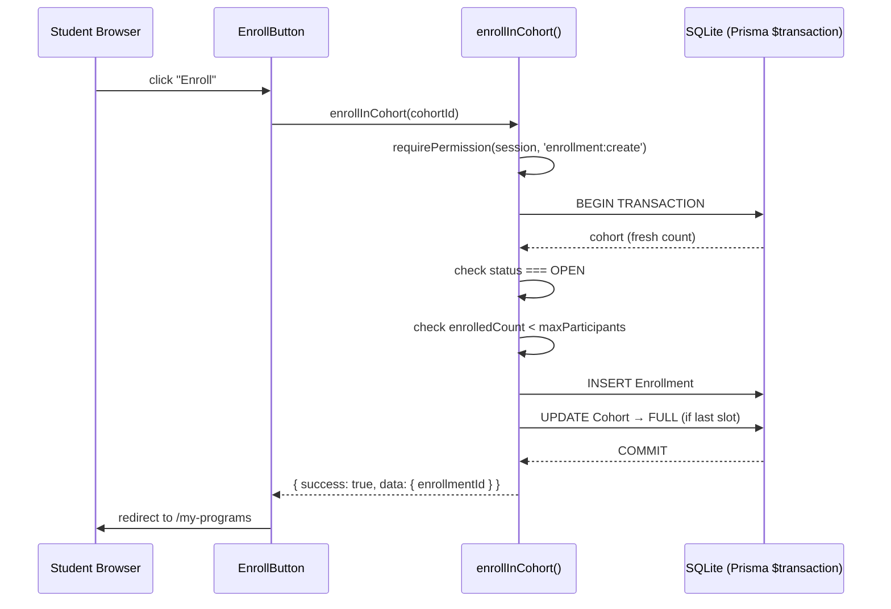
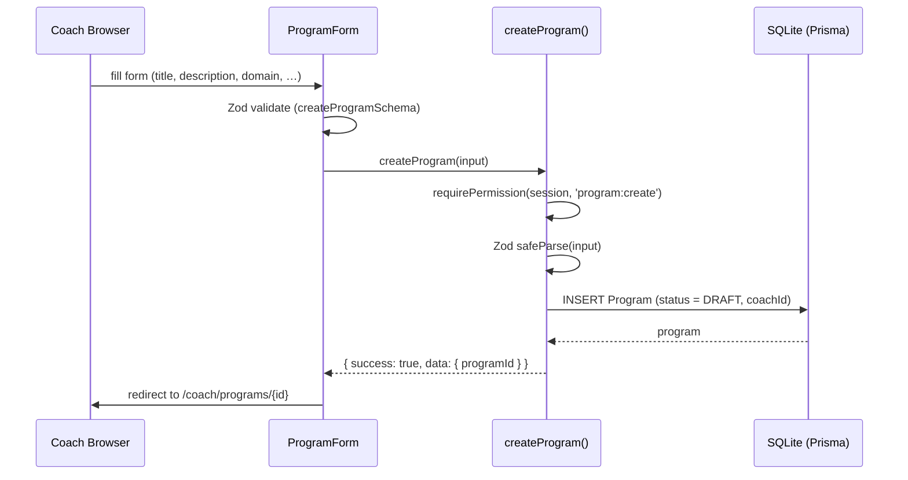
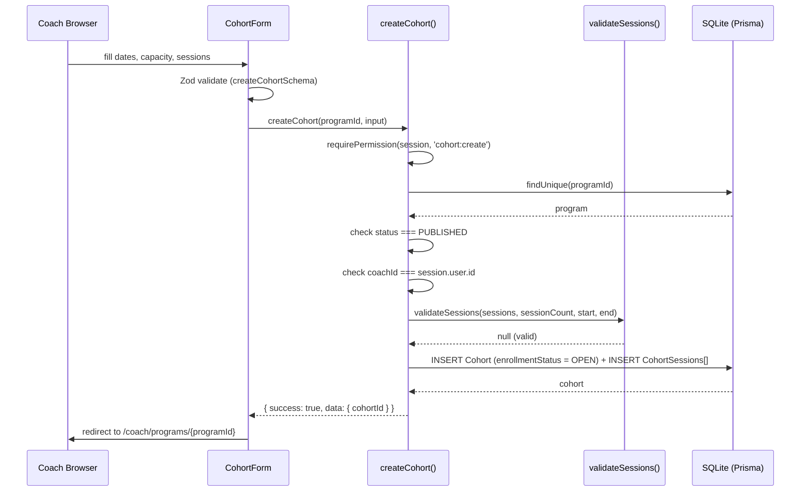
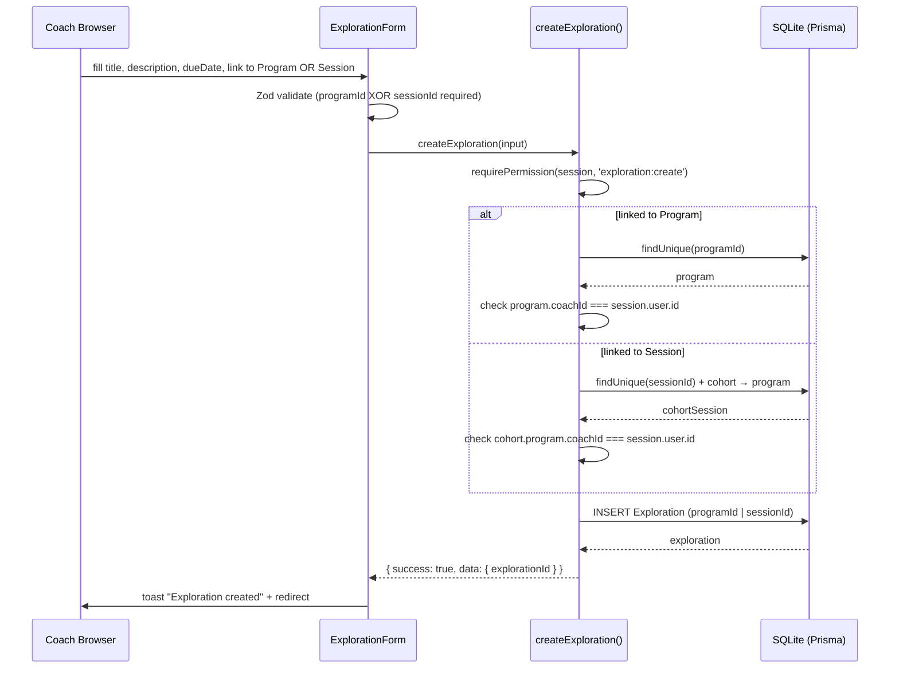
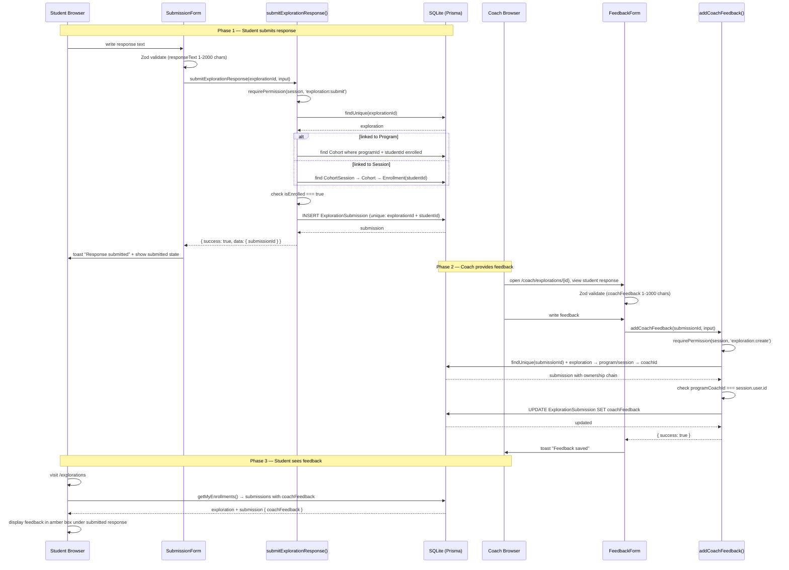
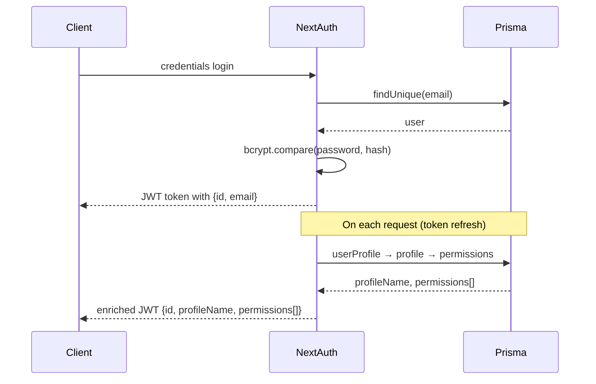

# Context Diagram — Nebula Job Immersion Platform

---

# Sequence — Enrollment Flow

---

# Sequence — Program Creation (Coach)

---

# Sequence — Cohort Creation (Coach)

---

# Sequence — Exploration Creation (Coach)

---

# Sequence — Exploration Submission & Coach Feedback

---

# Sequence — Auth JWT Callback

