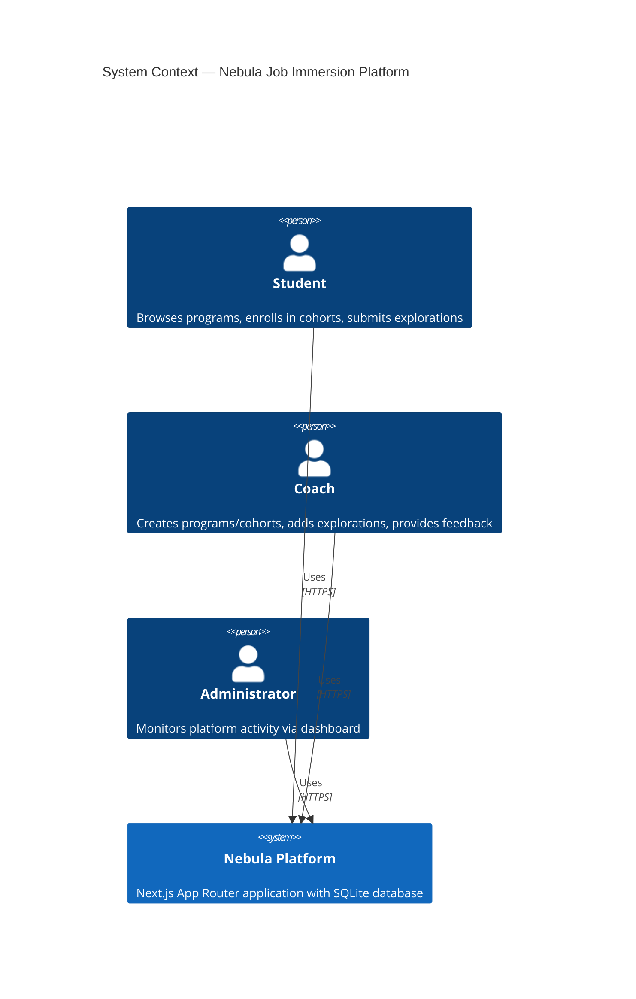
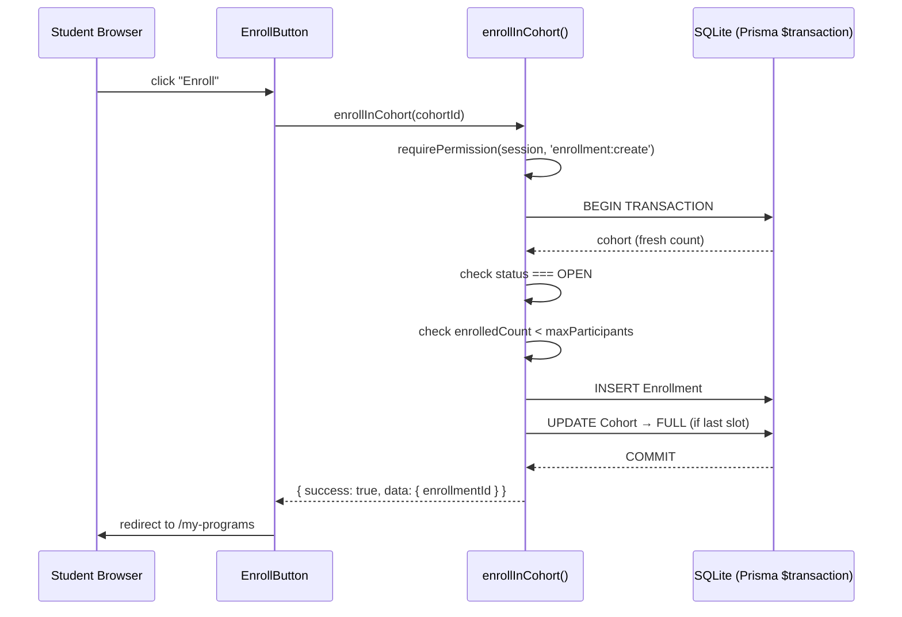
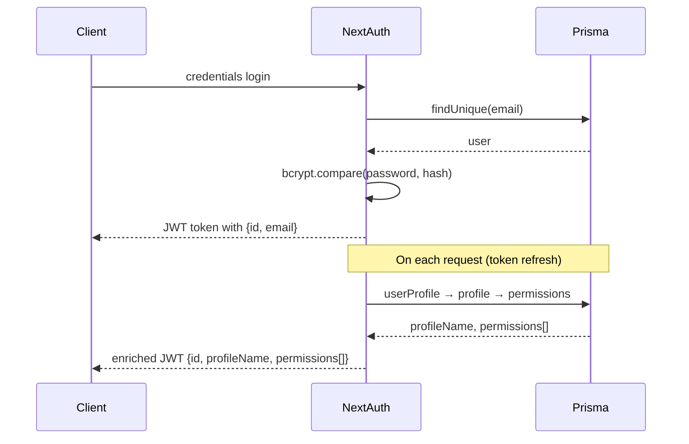

# Context Diagram — Nebula Job Immersion Platform

```mermaid
C4Context
    title System Context — Nebula Job Immersion Platform

    Person(student, "Student", "Browses programs, enrolls in cohorts, submits explorations")
    Person(coach, "Coach", "Creates programs/cohorts, adds explorations, provides feedback")
    Person(admin, "Administrator", "Monitors platform activity via dashboard")

    System(nebula, "Nebula Platform", "Next.js App Router application with SQLite database")

    Rel(student, nebula, "Uses", "HTTPS")
    Rel(coach, nebula, "Uses", "HTTPS")
    Rel(admin, nebula, "Uses", "HTTPS")
```

---

# Sequence — Enrollment Flow

```mermaid
sequenceDiagram
    participant S as Student Browser
    participant E as EnrollButton
    participant A as enrollInCohort()
    participant DB as SQLite (Prisma $transaction)

    S->>E: click "Enroll"
    E->>A: enrollInCohort(cohortId)
    A->>A: requirePermission(session, 'enrollment:create')
    A->>DB: BEGIN TRANSACTION
    DB-->>A: cohort (fresh count)
    A->>A: check status === OPEN
    A->>A: check enrolledCount < maxParticipants
    A->>DB: INSERT Enrollment
    A->>DB: UPDATE Cohort → FULL (if last slot)
    DB-->>A: COMMIT
    A-->>E: { success: true, data: { enrollmentId } }
    E->>S: redirect to /my-programs
```

---

# Sequence — Auth JWT Callback

```mermaid
sequenceDiagram
    participant C as Client
    participant NA as NextAuth
    participant DB as Prisma

    C->>NA: credentials login
    NA->>DB: findUnique(email)
    DB-->>NA: user
    NA->>NA: bcrypt.compare(password, hash)
    NA-->>C: JWT token with {id, email}

    Note over NA,DB: On each request (token refresh)
    NA->>DB: userProfile → profile → permissions
    DB-->>NA: profileName, permissions[]
    NA-->>C: enriched JWT {id, profileName, permissions[]}
```
