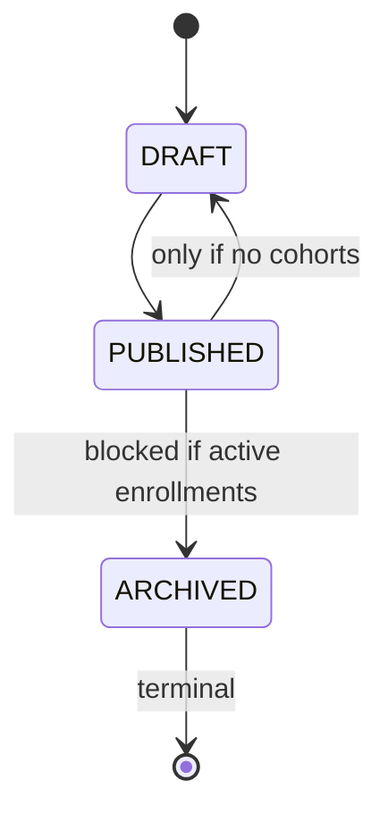

# Programs Feature

## Purpose

Manages the program catalog (browsing, creation, status transitions).

## Permissions

| Action                | Permission Required       |
|-----------------------|---------------------------|
| `getPublishedPrograms`| Public (no auth required) |
| `getProgramDetail`    | Public (coaches see own drafts) |
| `createProgram`       | `program:create`          |
| `updateProgram`       | `program:edit` + ownership |
| `getCoachPrograms`    | `program:edit`            |

## Status Transitions



## Session Count Lock

Once a cohort is created for a program, `sessionCount` cannot be changed (changing it would invalidate existing sessions).

## How to Test

```bash
npx vitest run src/features/programs/__tests__/
```
